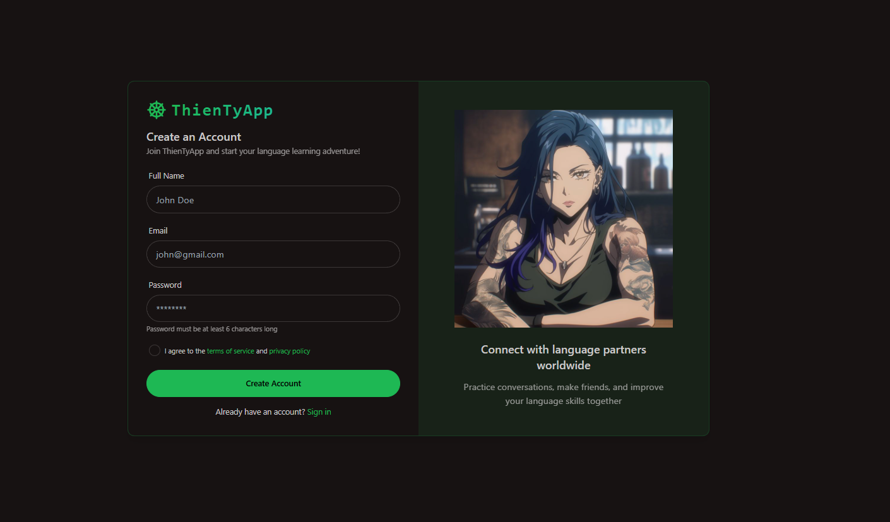
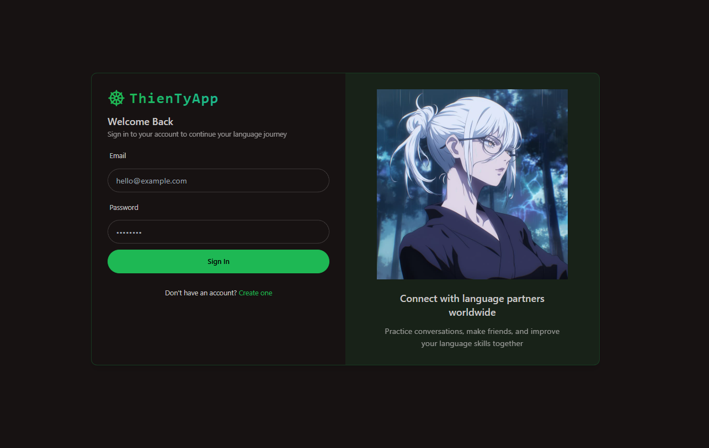

# Realtime-chat-app

<div align="center">Connect and chat in real-time, with a modern and responsive interface.</div>

<div align="center">
  
[](https://github.com/yourusername/Realtime-chat-app)
[](https://github.com/yourusername/Realtime-chat-app)
[](https://github.com/yourusername/Realtime-chat-app)

</div>

<div align="center">Built with the tools and technologies:</div>

<div align="center">
  
<!-- These technologies are confirmed to be used in the codebase -->
[](https://www.mongodb.com/)
[](https://expressjs.com/)
[](https://reactjs.org/)
[](https://nodejs.org/)
[](https://socket.io/)

</div>

<div align="center">
  
[](https://jwt.io/)
[](https://mongoosejs.com/)
[](https://tailwindcss.com/)
[](https://axios-http.com/)
[](https://github.com/motdotla/dotenv)

</div>

## Screenshots


*Trang chủ của ứng dụng*


*Giao diện đăng ký tài khoản*


*Giao diện đăng nhập*


*Hoàn thiện thông tin cá nhân*


*Giao diện chat thời gian thực*


*Quản lý thông báo*


*Giao diện cuộc gọi*

## Objective
This project aims to create a real-time chat application with the following goals:
1. Enable instant messaging between users
2. Support private and group conversations
3. Provide secure user authentication
4. Deliver a responsive and intuitive UI
5. Allow message history and media sharing

## Methodology
The system is built using the MERN stack:

### Backend Design
- **API**: Express.js handles RESTful endpoints for user and chat operations
- **Authentication**: JWT-based authentication secures user access
- **Database**: MongoDB stores user data and message history
- **Real-time**: Socket.IO enables instant message delivery
- **Validation**: Server-side validation ensures data integrity

### Frontend Design
- **Interface**: React with Tailwind CSS creates a responsive UI
- **State Management**: React Context API manages application state
- **Real-time**: Socket.IO client connects to the server
- **HTTP Requests**: Axios handles API communication

### Process
- User registers or logs in through the authentication system
- Backend validates credentials and issues JWT tokens
- Users can create chats, send messages, and receive real-time updates
- Messages are stored in MongoDB for persistence
- Frontend updates in real-time when new messages arrive

## Tools
- **Backend**: Node.js, Express, MongoDB, Mongoose, Socket.IO
- **Frontend**: React, Tailwind CSS, Axios, Socket.IO Client
- **Authentication**: JWT, bcrypt
- **Development**: Nodemon, Vite

## Features
1. Real-time messaging with typing indicators
2. User authentication and profile management
3. Private and group chat support
4. Message history persistence
5. Responsive design for mobile and desktop
6. Online status indicators
7. Read receipts
8. Media sharing capabilities

## Getting Started

### Prerequisites
- Node.js (v16 or higher)
- MongoDB
- npm or yarn

### Installation

1. Clone the repository
   ```
   git clone https://github.com/yourusername/Realtime-chat-app.git
   cd Realtime-chat-app
   ```

2. Set up environment variables
   - Create `.env` file in the backend directory with:
     ```
     PORT=5000
     MONGODB_URI=mongodb://localhost:27017/chatapp
     JWT_SECRET=yoursecretkey
     ```
   - Create `.env` file in the frontend directory with:
     ```
     VITE_API_URL=http://localhost:5000/api
     ```

3. Install dependencies and start development servers
   ```
   # Install dependencies for both frontend and backend
   npm install
   
   # Run frontend development server
   cd frontend
   npm run dev
   
   # Run backend development server (in a separate terminal)
   cd backend
   npm run dev
   ```

4. For production
   ```
   npm run build
   npm start
   ```

## API Endpoints
- `POST /api/auth/register`: Register a new user
- `POST /api/auth/login`: User login
- `GET /api/users`: Get all users
- `GET /api/chats`: Get user's chats
- `POST /api/chats`: Create a new chat
- `GET /api/messages/:chatId`: Get messages in a chat
- `POST /api/messages`: Send a new message

## Future Plans
1. Voice and video calling integration
2. End-to-end encryption
3. Push notifications
4. File sharing and cloud storage
5. Message search functionality

## License
MIT